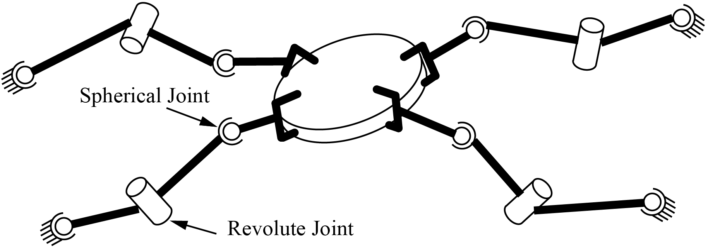
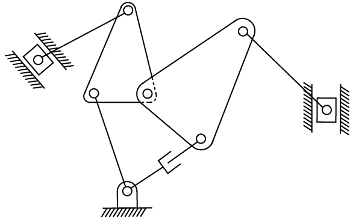
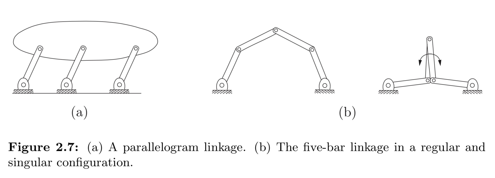

This chapter answered the question about how to represent a robot in space. First, we introduced the concept of **degrees of freedom (dof)** and **configuration space (C-space)**. Then we talked about DoF of a rigid body and extended it to exploiting **Grübler's Formula** to calculate DoF of a robot. Later, we discussed about the **topology**, **representation** and **constraints** of C-space.

## DoF and Grübler's Formula

> Definition: The **configuration** of a robot is a complete specification of the position of every point of the robot. The minimum number $$n$$ of real-valued coordinates needed to represent the configuration is the number of **degrees of freedom (dof)** of the robot. The $$n$$-dimensional space containing all possible configuration of the robot is called the **configuration space (C-space)**. The configuration of a robot is represented by a point in the C-space.

### DoF of Single Rigid Body

We started with calculating the DoF of a coin on a plane. The problem is trivial but the menthod used is worth noting: we attach three fixed points to the coin and came out with three constraints to describe the relative positions between the points. Three points means six variables, but then we discovered that not all variables are necessary based on the constraints. The same idea can also exploited to calculate the DoF of a coin in space. Understanding these two examples can be helpful, because from them we can conclude an initial idea for Grübler's Formula:

$$
DoF = \text{(sum of freedoms of the points)} - \text{(number of independent constraints)}
$$

### DoF of Robots and Grübler's Formula

First, recall the definition of robot given in the textbook:

> A robot is mechanically constructed by connecting a set of bodies, called **links**, to each other using various types of **joints**. **Actuators**, such as electric motors, deliver forces or torques that cause the robot’s links to move. Usually an **end-effector**, such as a gripper or hand for grasping and manipulating objects, is attached to a specific link. All the robots considered in this book have links that can be modeled as rigid bodies.

From the example of the door, we realized that for a robot, the motion of its **links** are constrained by its **joints**. This gives us a similar idea with the formula above, and leads us to **Grübler's Formula**. Here we also introduce common types of joints and their DoF and constraints.

Now, we introduce **Grübler's Formula**, which can be exploited to calculate the DoF of a mechanism with links and joints.

Given a mechanism consisting of $N$ links(including the gound as a link), $J$ joints. The number of degrees of freedom of a body is $m$, the number of freedoms and constraints provided by joint $i$ are $f_i$ and $c_i$, Grübler's formula can written as:

$$
\begin{aligned}
dof = & \underbrace{m(N-1)}_{\text{rigid body freedoms}} - \underbrace{\sum_{i=1}^{J}c_i}_{\text{joint constraints}} \\
    = & m(J-1-N) + \sum_{i=1}^{J}f_i
\end{aligned}
$$

### Several Notes for Grübler's Formula {#notes_grubler}

1. The ground is always considered as a link, but its number of degrees of freedom is 0.
2. Careful with **overlapping joints**: example 2.5, page 20 of the textbook.
3. Careful with **redundant constraints and sigularities**: example 2.6, page 21 of the textbook. Recall that Grübler's formula holds only if the constraints are independent, if they are NOT independent, then the result of Grübler's formula serves as the lower bound on the dof(**In this case, the dof can be negative**). Configuration space sigularities arising in closed chains are discussed later.
4. The Delta robot: example 2.7, page 22 of the textbook. Even though the dof calculated from Grübler's formula is 15, but only 3 are visible at the end-effector. This is because that one degree of freedom in a spherical joint is for torsion.

### Some Quiz Questions

1. (Question 3 of quiz of chapter 2, part 1) Assume your arm, from your shoulder to your palm, has 7 degrees of freedom. You are carrying a tray like a waiter, and you must keep the tray horizontal to avoid spilling drinks on the tray. How many degrees of freedom does your arm have while satisfying the constraint that the tray stays horizontal? Your answer should be an integer.
   * The answer is 5.
   * *The requirement that the tray be horizontal places two constraints on its orientation: the rotation of the tray about two axes defining the horizontal plane of the tray must be zero. (In other words, the roll and the pitch of the tray are zero.)*
2. (Question 4&5 of quiz of chapter 2, part 1) A total of $n$ identical SRS arms are grasping a common object as shown below. Find the number of degrees of freedom of this system while the grippers hold the object rigidly (no relative motion between the object and the last links of the SRS arms). Your answer should be a mathematical expression including $n$.
   * The answer is $n+6$.
   * Note that all the graspers, together with the object, should be considered as a single link. 

3. (Question 7 of quiz of chapter 2, part 1) Use the planar version of Grubler's formula to determine the number of degrees of freedom of the mechanism shown below. Your answer should be an integer.
   * The answer is 3.
   * Removing all the **redundant joints**, this mechanism is same with an open-chain, 3R arm. 

## C-Space: Topology and Representation

For now our focus is on the dimension of the C-space, but the shape of the space is also worth mentioning. A good example of why we care about this is the difference between a sphere and a plane. Both are two-dimensional, but obviously they are representing two different spaces.

### Configuration Space Topology

To describe the "shape" of a C-space, we introduce the concept of **topology**, and the book gave an unformal definition of **topologically equivalent**. Even though the authors do not attempt a rigorous treatment in this book, readers are still supposed to know the meaning of notations like $\mathbb{R}^n$ *(the $n$-dimensional Euclidean space)*, $S^n$ *($n$-dimensional surface of a sphere in $(n+1)$-dimensional space)*, $T^n$ *($n$-dimensional surface of a torus in an $(n+1)$-dimensional space)* and *Cartesian product* of two or more spaces *(which can generate spaces with higher dimensions)*. 

Here knowing the C-spaces of common mechanisms can be helpful, which can also be confusing, for example:

1. What's the difference between $T^2 = S^1 \times S^1$ and $S^2$?
2. Why the C-space of rigid body in space can be written as $\mathbb{R}^3 \times S^2 \times S^1$?

### Configuration Space Representation

Now, it's time to think about the *numerical* **representation** of a space, for example, a point in a Euclidean space can be represented by a real number vector.

> It is important to keep in mind that the representation of a space involves a choice, and therefore it is not as fundamental as the topology of the space, which is independent of the representation.

For different spaces, there are two different representations:

**Explicit Representation**:
* It uses $n$ parameters to represent a $n$-dimensional space.
* But it has sigularities, for example the North/South pole situation.
* There are two solutions for the sigularities:
  * Use multiple coordinate charts (atlas).
  * Use **implicit representation**.

**Implicit Representation**:
* It uses more parameters than the space's dof. It views the $n$-dimensional space as embedded in a Euclidean space of more than $n$ dimensions.
* It uses the coordinates of the higher-dimensional space, but subjects these coordinates to *constraints* that reduce the number of degrees of freedom.
* It has advantage in representing closed-chain mechanism.
* Choice of the book.

## Configuration and Velocity Constraints

We've mentioned that implicit representation uses constraints to reduce the number of degrees of freedom. Now let's discuss more details about the constraints.

**Holonomic Constraints**:
* Constraints that reduce the dimension of C-space.
* The C-space can be viewed as a surface of dimension $n-k$ embedded in $\mathbb{R}^n$, where $n$ indicates the number of parameters that are used to represent the space, and $k$ indicates the number of constraints. (In the example of the planar, closed-chain, four-bar linkage, $n=4$ and $k=3$)

**Pfaffian Constraints**
* Velocity constraints in the form of $A(\theta)\dot{\theta} = 0$ are named Pfaffian constraints. (Where does this form come from?)
* Some of them are the derivative of a set of holonomic constraints.

**Nonholonomic Constraints**
* Pfaffian constraints that are nonintegrable. (Figure 2.11: A coin rolling on a plane without slipping)
* Reduces the dimension of feasible velocities of the system, but do not reduce the reachable C-space. (The rolling coin can reach any place in its four-dimensional C-space despite the two constraints on its velocity)

## Task Space and Work Space

> We now introduce two more concepts of relating to the configuration of a robot: the task space and the workspace. Both relate to the configuration of the end-effector of a robot, not to the configuration of the entire robot.

**Task Space**: The space in which the robot's task is naturally described.

**Work Space**: A specification of the reachable configurations of the end-effector.

Recall that both spaces are distinct from the robot's C-space.

## My Questions

### Configuration Space Singularity in Five-Bar Linkage

In Figure 2.7(b), as shown below, if the two joints connected to the ground are locked, then the mechanism has a dof of zero. This is true in most cases, and can be verified by Grübler's formula. (freedoms of the locked joints and other joints are zero and one)

However, this mechanism has a singularity, as shown in the right sub-figure. If the two middle links have a same length and overlap each other, then these two links can rotate together freely.

**So, is Grübler's formula applicable in this case?**

My solution is, for this singularity, similar with the mechanism in figure (a), the two links of one side (right or left), together with the three joints, have no effect on the motion of the mechanism. Thus, recall that $m=3, N=3, J=2$, and $f_1=1, f_2=0$, $dof = m(N-1-J) + f_1 + f_2 = 1$.

### The Human Arm Problem

For the human arm problem mentioned above, the given solution indicates that there are two constraints on the palm to keep the tray horizontal. However, if we assume the arm is a SRS mechanism, which is the assumption of the given solution, the dof should be **seven**. Even though the tray must be horizontal, the spherical joint can still move in all three degrees, with the corporation with the rest two joints. Is my understanding correct?

***

<button type="button" onclick="window.location.href='#top';">Back To Top</button>
<button type="button" onclick="alert('This is the first chapter!')">Previous</button>
<button type="button" onclick="window.location.href='../ch3/index.html';">Next</button>

